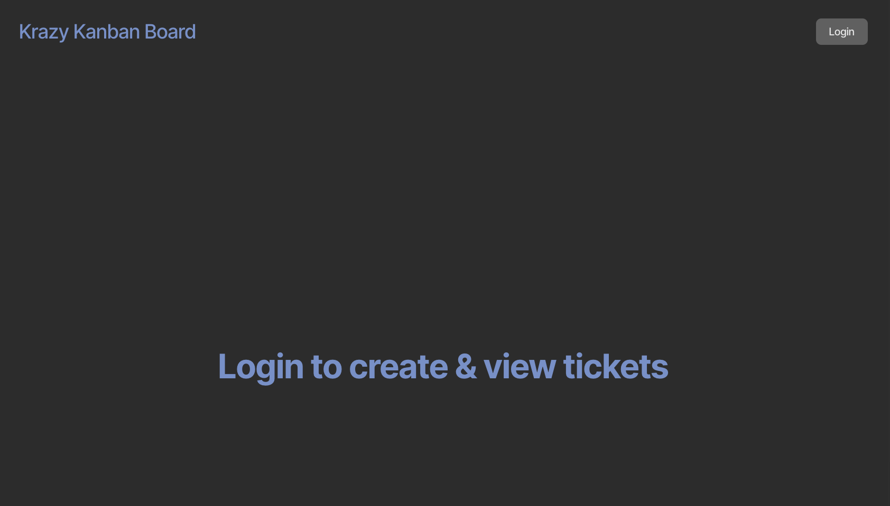
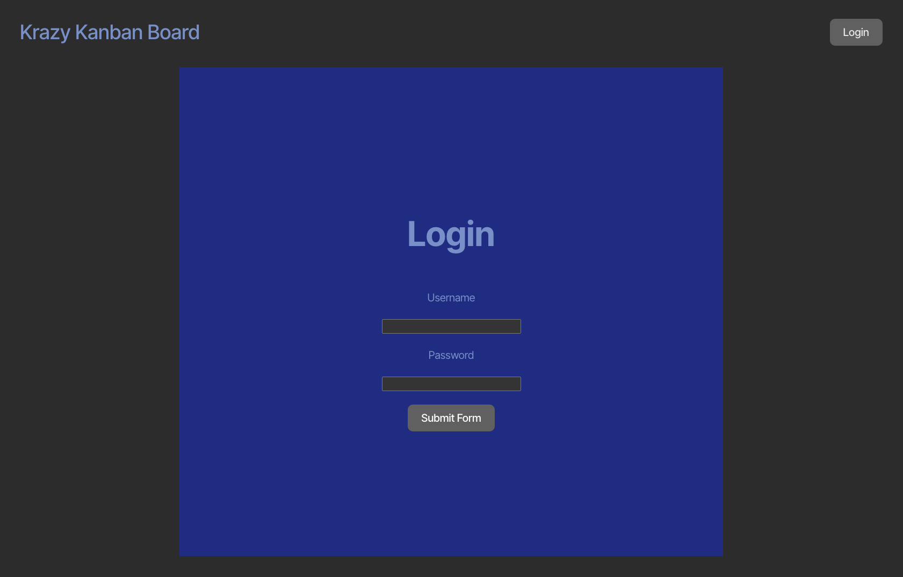
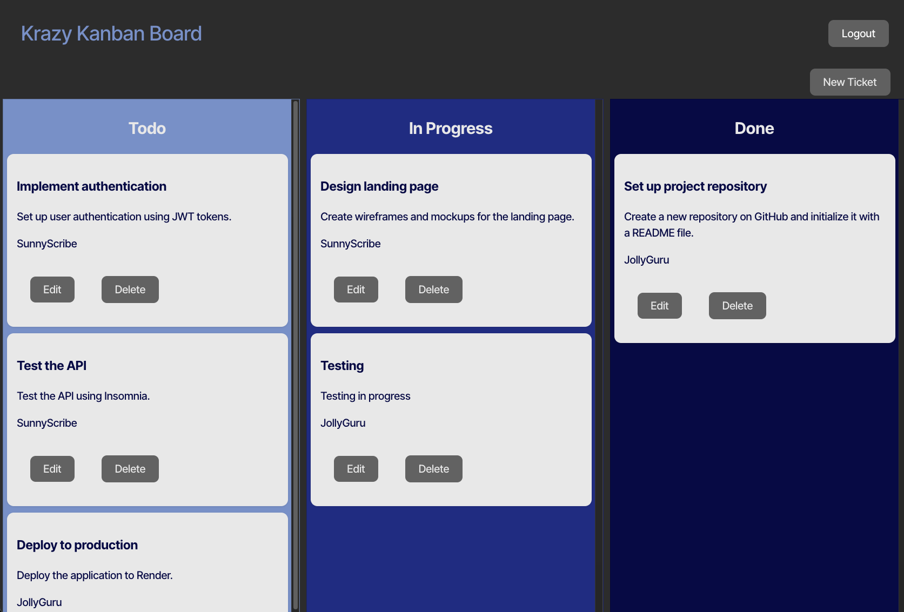

# Kanban Board
[](https://opensource.org/licenses/MIT)

## Description
This Kanban board is a visual tool that helps teams manage tasks and workflows by organizing them into columns that represent different stages of a process (like "To Do," "In Progress," and "Done"). Each task is displayed on a card, which moves across the columns as it progresses. This layout provides a clear, at-a-glance overview of work status, helping teams see what’s being worked on, identify bottlenecks, and keep workflows efficient.

## Table of Contents
* [Installation](#installation)
* [Usage](#usage)
* [License](#license)
* [GitHub](#github)
* [Questions](#questions)

## Installation
#### If you want the code used to create this application:
1. **Clone the Repository**:
   Open your terminal and run the following command to clone the repository to your local machine:

   ```bash
   git clone https://github.com/JoshAskew/Kanban-Board

2. **Navigate to the Project Directory** :

    ```bash
    cd your-repo-name
3. **Install Dependencies**: 
    Make sure you have Node.js installed on your machine. If you haven't installed it yet, you can download it [here](https://nodejs.org/en).

    Then, install the required packages using npm:
    ```bash
    npm install
4. **Run the Application**: 
    You can now run the application by executing the following command:
    ```bash
    npm run start
## Usage
This application is accessible in two ways:

1. **Locally**: Clone the repository, install the necessary dependencies, and run the application from the command line.
2. **Deployed Version**: Visit the live version of the application here: [Kanban Board]().


**Here, you can see what the Landing Page looks like when you open the application:**


**Here, you can see what the Login Page looks like:**


**Here, you can see what the main page after login looks like:**



## License
This project is licensed under the MIT license.


* [License](https://opensource.org/license/mit)

## GitHub
[JoshAskew](https://github.com/JoshAskew)

## Questions
If you have any questions reguarding this application, feel free to e-mail me at asksprit3@gmail.com

## Credits
- **University of Minnesota**: For providing resources and support throughout this project.
- **Node.js**: For the powerful JavaScript runtime that enabled the development of this application.
- **Vite**: For the fast and efficient build tool that streamlined the development process.
- **Render**: For the seamless deployment platform that allowed easy hosting and management of the application.